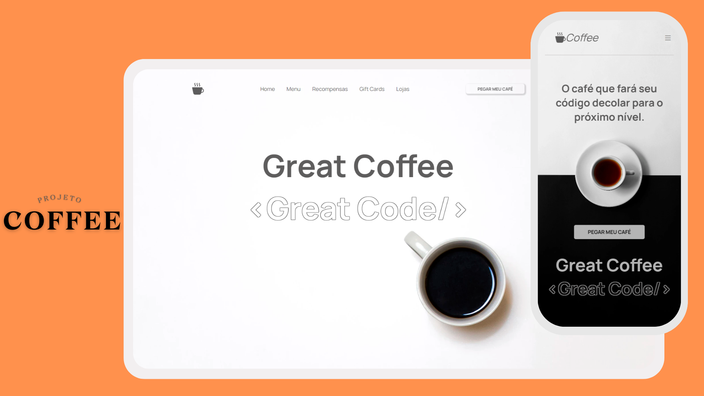

<h1 align="center">#11 Coffee</h1>
<h2 align="center">Site Coffee</h2>

 O site Coffee apresenta um design responsivo, destacando a sinergia entre café e código, com um menu de navegação e o convite para "PEGAR MEU CAFÉ".

  <a href="#-tecnologias">Tecnologias</a>&nbsp;&nbsp;&nbsp;|&nbsp;&nbsp;&nbsp;
  <a href="#-projeto">Projeto</a>&nbsp;&nbsp;&nbsp;|&nbsp;&nbsp;&nbsp;
  <a href="#-layout">Layout</a>&nbsp;&nbsp;&nbsp;|&nbsp;&nbsp;&nbsp;

  

 

  

## 🚀 Tecnologias
- HTML: Linguagem de marcação utilizada para estruturar o conteúdo da página.
- CSS: Estilização da página, incluindo o uso de estilos para diferentes dispositivos (responsividade).
- Bootstrap Icons: Ícones utilizados no projeto, provenientes da biblioteca Bootstrap Icons.
- JavaScript: utilizado para interações dinâmicas na página.

## 💻 Projeto
O projeto consiste em um site relacionado a café, com as seguintes funcionalidades e seções:

- Header: Contém um logotipo (ícone de xícara de café), menu de navegação (Home, Menu, Recompensas, Gift Cards, Lojas), e um botão "PEGAR MEU CAFÉ" para desktop.
- Main: Contém títulos, textos e um botão "PEGAR MEU CAFÉ" adaptado para diferentes dispositivos. Destaca a conexão entre café e código.

## 🎨 Layout
- Responsividade: O layout é adaptado para diferentes dispositivos, utilizando folhas de estilo específicas para desktop e mobile.
- Você pode visualizar o layout do projeto através [DESSE LINK](<https://jasonaraujo1.github.io/blog/>). 

## 🔍 Instruções do Site
- Navegação: O menu de navegação permite acessar diferentes seções do site.
- Botão "PEGAR MEU CAFÉ": Disponível tanto no header quanto no main, convidando o usuário a realizar alguma ação (possivelmente um link para outra página).

## :memo: Licença

Esse projeto está sob a licença MIT.

---

Instruções pela [Sua Empresa/Equipe](https://seusite.com) :wave: [Participe da nossa comunidade!](https://discord.gg/sua-comunidade)
